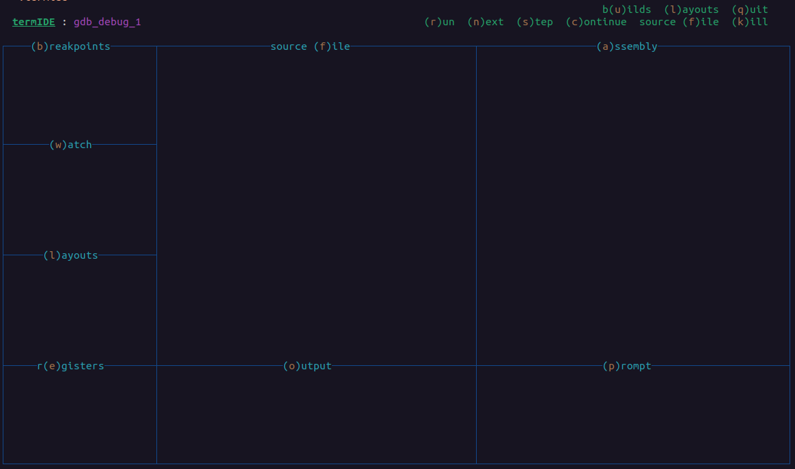

# term_debug

A multi-language terminal debugger for GNU/Linux

**\*\* In development \*\***


## Configuration

Unique, three-character, case-sensitive "plugin" codes are each associated with a specific debugger action or window. The codes are bound to user-defined shortcut keys. The key characters are used to create custom layouts.
<br />

### Example configuration...

```
[ keys ]

Qut : q : (q)uit
Bak : b : (p)rev
Bld : u : b(u)ilds
Lay : l : (l)ayouts
Run : r : (r)un
Nxt : n : (n)ext
Stp : s : (s)tep
Con : c : (c)ontinue
Fin : i : f(i)nish
Kil : k : (k)ill
Brk : b : (b)reakpoints
Src : f : source (f)ile
Asm : a : (a)ssembly
Reg : e : r(e)gisters
Prm : m : pro(m)pt
Wat : w : (w)atch
LcV : v : local (v)ars
Out : o : (o)utput


[ layout : gdb_debug_1 ]

>h
ulpq
rnscfk

>w
bffaa 
wffaa
lffaa
eoopp
```


### Resulting layout...


<br />


### File location

`$PROJECT_DIR/.term_debug` <br />
or <br />
`$HOME/.term_debug`
<br /><br />
 

### Formatting

#### Plugins ( `[ plugins ]` ):

- `<code> : <key> : <title>`

  - `code`
    - Plugin code identifier

  - `key`
    - Key binding

  - `title`
    - String displayed in header or window
    - Adding parentheses around the key binding allows term_debug to change its color for better visibility.
<br />

#### Layout ( `[ layout : gdb_debug_1 ]` ):

- Title ( `gdb_debug_1` ):
  - Title displayed in header
  - Identifier used by layouts plugin (`Lay`) to switch layouts
<br /><br />

- Window sections:
  - The characters under each `>section` correspond to the plugin key bindings defined under `[ plugins ]`. 

  - `>h`  
    - Header window 
      - Each character determines the row and position of its corresponding title string.

  - `>w`  
    - Windows layout
      - Each character represents a "segment" of that particular window.
      - The number of segments a window has vertically and horizontally determines the number of terminal rows and columns it is assigned.
<br /><br />


## Build

### Production
```
$ make
```
### Development
```
$ make dev
```
<br /><br />

