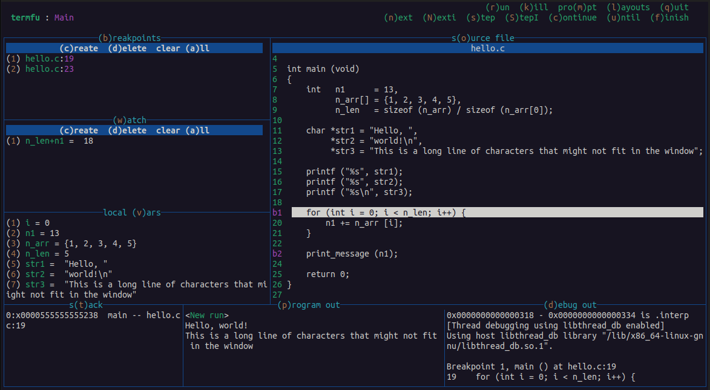
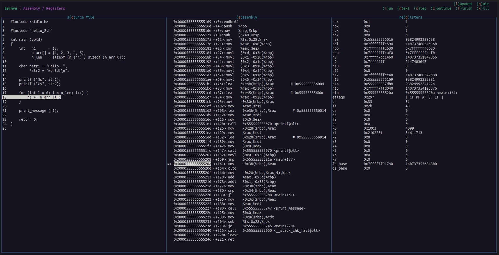

<h1 align="center">termfu</h1>
<p align="center">A frictionless, multi-language terminal debugger for Linux that allows users to create and switch between custom layouts</p>
<br>
<p align="center"></p>
<br>


## Support

| Debugger   | Languages |
|   :----:   | -----     |
| [GDB](https://sourceware.org/gdb/) | C, C++, D, Go, Objective-C, Fortran, OpenCL C, Pascal, Rust, assembly, Modula-2, Ada |
| [PDB](https://docs.python.org/3/library/pdb.html) | Python |
<br>

## Install from source

### Dependencies

Ubuntu:
```
sudo apt-get install make gcc libncurses6-dev gdb pdb
```

### Build
```
make
```
<br>

Copy `termfu` to the desired executable directory, e.g. `/usr/bin`. 
<br><br>


## Usage

- The program can be run as follows in the same directory as a `.termfu` configuration file.
- Breakpoint and watchpoint data is stored in `.termfu_data`.
```bash
termfu
```

- `-h` prints usage instructions.
- `-c` sets the configuration file path.
- `-p` sets the data persist file path.
```bash
termfu -c .termfu_01 -p .termfu_01_data
```

- Configure the debugger command, key bindings, titles, and layouts inside the configuration file  _(see below)_.
- Switch between layouts with your `(l)ayouts` shortcut.
- Window data can be scrolled through using the arrow or `hjkl` keys.
<br><br>


## Configuration
Each three-character, case-sensitive plugin code corresponds to a specific header command or window. 
<br>

### Plugins

__Header Commands__
<br>

| Code    | Description           | GDB                | PDB                |
| :-----: | ------                | :----:             | :----:             |
| AtP     | Attach to PID, file   | :heavy_check_mark: |                    |
| Con     | Continue              | :heavy_check_mark: | :heavy_check_mark: |
| Fin     | Finish                | :heavy_check_mark: | :heavy_check_mark: |
| Kil     | Kill                  | :heavy_check_mark: | :heavy_check_mark: |
| Lay     | Choose layout         | :heavy_check_mark: | :heavy_check_mark: |
| Nxt     | Next                  | :heavy_check_mark: | :heavy_check_mark: |
| Prm     | Debugger prompt       | :heavy_check_mark: | :heavy_check_mark: |
| Qut     | Quit                  | :heavy_check_mark: | :heavy_check_mark: |
| Run     | Run, reload program   | :heavy_check_mark: | :heavy_check_mark: |
| Stp     | Step                  | :heavy_check_mark: | :heavy_check_mark: |
| Trg     | Target remote server  | :heavy_check_mark: |                    |
| Unt     | Until                 | :heavy_check_mark: | :heavy_check_mark: |
<br>

__Windows__
<br>

| Code    | Description      | GDB                | PDB                |
| :-----: | -----            | :-----:            | :------:           |
| Asm     | Assembly code    | :heavy_check_mark: |                    |   
| Brk     | Breakpoints      | :heavy_check_mark: | :heavy_check_mark: |
| Dbg     | Debugger output  | :heavy_check_mark: | :heavy_check_mark: |
| LcV     | Local variables  | :heavy_check_mark: | :heavy_check_mark: |
| Prg     | Program output   | :heavy_check_mark: | :heavy_check_mark: |
| Reg     | Registers        | :heavy_check_mark: |                    |
| Src     | Source file      | :heavy_check_mark: | :heavy_check_mark: |
| Stk     | Stack            | :heavy_check_mark: | :heavy_check_mark: |
| Wat     | Watchpoints      | :heavy_check_mark: | :heavy_check_mark: |
<br>


### Configuration setup

Plugin codes are mapped to case-sensitive letter keys, which are used both as shortcuts and to create custom layouts.
<br>

- Add parentheses around a shortcut key in its `<(t)itle>` for easy reference. These characters will have a different color than the surrounding letters.
- The order and line of command titles in the header are set by the order and line of the key bindings.
- Window size ratios and position are set via "key-binding ASCII art."
- Only newline `# comments` are supported, not inline.

### Sections

| Section   | Description |
| :----:    |  :----: |
| command | Debugger command |
| plugins | \<plugin code\> : \<key binding\> : \<title\> |
| layout  | \[ layout : \<label\> \] <br>`>h` : header commands,  `>w` : windows |

### Supported commands

| Debugger | Command |
| :-----:  | ------  |
| GDB      | `gdb --interpreter=mi ...` |
| PDB      | `python -m pdb ...` |
<br>

### Example `.termfu` configuration


```
[ command ]

gdb --quiet --interpreter=mi misc/vars

[ plugins ]

# header commands
AtP : A : (A)ttach
Con : c : (c)ontinue
Fin : f : (f)inish
Kil : k : (k)ill
Lay : l : (l)ayouts
Nxt : n : (n)ext
Prm : m : pro(m)pt
Qut : q : (q)uit
Run : r : (r)un
Stp : s : (s)tep
Unt : u : (u)ntil

# windows
Asm : a : (a)ssembly
Brk : e : br(e)akpoints
Dbg : d : (d)ebug out
LcV : v : local (v)ars
Prg : p : (p)rogram out
Reg : g : re(g)isters
Src : o : s(o)urce file
Stk : T : s(T)ack
Wat : w : (w)atch


[ layout : Main ]

>h
mlqrns
cufk

>w
eeeooooo
wwwooooo
vvvooooo
TTpppddd

[ layout : Assembly / Registers ]

>h
mlqrns
cufk

>w
oag
oag
oag
wdT
```
<br>


### Resulting layouts



<br>

## Debugging tips

### Easy Vim, Neovim breakpoints

Use these functions to create and copy a breakpoint string (`<file>:<line>`) from the current line to paste into `termfu`'s breakpoint window.

__Vim__
```vim
  function! CreateBreakpoint()
      let l:filename   = expand('%:t')
      let l:linenumber = line('.')
      let l:breakpoint = l:filename . ':' . l:linenumber
      let @+           = l:breakpoint
      echo l:breakpoint
  endfunction
  nnoremap <leader>b :call CreateBreakpoint()<CR>
```

__Neovim__
```lua
local function create_break ()
    local filename = vim.fn.expand('%:t')
    local linenumber = vim.fn.line('.')
    local breakpoint = filename .. ':' .. linenumber
    vim.fn.setreg('+', breakpoint)
    print(breakpoint)
end
vim.keymap.set('n', '<leader>b', create_break, {desc = 'Create debugger breakpoint string'});
```
<br>

## Contributing

### General Guidelines
- For any significant contributions outside of patches, open an issue first.
- Bug fixes, optimizations, new debugger implementations, tips, and new plugins are welcome.
- Blank space and comment PRs have a high probability of being closed.
- Use existing code conventions.

### Developer notes
- Run `make help` to print all commands, descriptions, and associated scripts. Read the script comments for more information and usage instructions.
- Feel free to edit the `scripts/.termfu...` configurations but do not include them in a PR. All watchpoints and breakpoints are persisted in `_data` files alongside their respective configuration.
- Run `make todo` to print all source file tags, such as `TODO`, `FIX`, etc.
- You can debug `termfu` with the `GDB` TUI or with `termfu` itself. The `make proc_<debugger>` scripts start a termfu_dev process to be debugged by the `make conn_proc_<debugger>` scripts.
- The `logd()` function in `src/utilities.h` allows for `printf()`-style debugging when running `ncurses` by outputting to `debug.out`.
- Run `make help` in the `tests/` directory to view available scripts.
- All errors that require the program to exit must propagate back to `main()` using the formatted error macro functions in `utilities.h`. Standard library function error checking must include the `errno` message when available.
- It is recommended to create a shortcut for refreshing your terminal screen, as `ncurses` will make a mess of it when not shut down properly.

<br><br>

