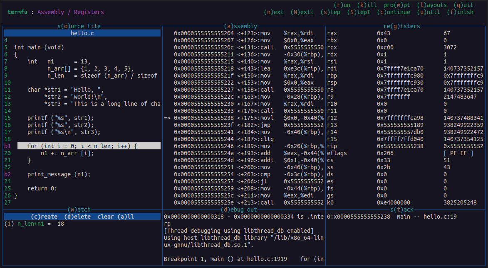

<h1 align="center">termfu</h1>
<p align="center">An easy-to-use, multi-language terminal debugger that allows users to create and switch between custom layouts</p>
<br>
<p align="center"></p>
<br>


## Support

| Debugger   | Languages |
|   :----:   | -----     |
| [GDB](https://sourceware.org/gdb/) | C, C++, D, Go, Objective-C, Fortran, OpenCL C, Pascal, Rust, assembly, Modula-2, Ada |
| [PDB](https://docs.python.org/3/library/pdb.html) | Python |
<br>

## Install from source

### Dependencies

The Makefile uses `ncurses6`.
```
sudo apt-get install libncurses-dev gdb pdb make
```
### Build
```
make
```
<br>

Copy `termfu` to the desired executable directory, e.g. `/usr/bin`. 
<br><br>


## Usage
```
termfu
```
- The program must be run in the same directory as a `.termfu` configuration file.
- Configure the debugger command and layout(s).
- Breakpoints and watchpoints are persisted in `.termfu_data`. 
- Select a window and scroll through the data using arrow or `hjkl` keys.
- Switch layouts with `(l)ayouts`.
- Send custom debugger commands with `pro(m)pt`.
<br><br>


## Configuration
Each three-character, case-sensitive plugin code corresponds to a specific action or window. These codes are mapped to keys, which are used as shortcuts and to create custom layouts. 
<br>

### Plugins

__Header Commands__
<br>

| Code    | Description |
| :-----: | ------ |
| Con     | Continue |
| Fin     | Finish |
| Kil     | Kill |
| Lay     | Choose layout |
| Nxt     | Next |
| Prm     | Debugger prompt |
| Qut     | Quit |
| Run     | Run program (reload binary if needed) |
| Stp     | Step |
| Unt     | Until |
<br>

__Windows__
<br>

| Code    | Description      | GDB                | PDB                |
| :-----: | -----            | :-----:            | :------:           |
| Asm     | Assembly code    | :heavy_check_mark: |                    |   
| Brk     | Breakpoints      | :heavy_check_mark: | :heavy_check_mark: |
| Dbg     | Debugger output  | :heavy_check_mark: | :heavy_check_mark: |
| LcV     | Local variables  | :heavy_check_mark: |                    |
| Prg     | Program output   | :heavy_check_mark: |                    |
| Reg     | Registers        | :heavy_check_mark: |                    |
| Src     | Source file      | :heavy_check_mark: | :heavy_check_mark: |
| Stk     | Stack            | :heavy_check_mark: |                    |
| Wat     | Watchpoints      | :heavy_check_mark: | :heavy_check_mark: |
<br>


### Configuration sections

- Adding parentheses around a character in a `<(t)itle>` changes the character's color.
- Only newline `# comments` are supported, not inline.

| Section   | Description |
| :----:    |  :----: |
| command | Debugger command |
| plugins | \<plugin code\> : \<key binding\> : \<title\> |
| layout  | \[ layout : <title> \] <br>`>h` : header commands,  `>w` : windows |
<br>

### Commands

| Debugger | Command |
| :-----:  | ------  |
| GDB      | `gdb --interpreter=mi ...` |
| PDB      | `python -m pdb ...` |
<br>

### Example `.termfu` configuration


```
[ command ]

gdb --interpreter=mi misc/hello

[ plugins ]

# windows
Asm : a : (a)ssembly
Brk : e : br(e)akpoints
Dbg : d : (d)ebug out
LcV : v : local (v)ars
Prg : p : (p)rogram out
Reg : g : re(g)isters
Src : o : s(o)urce file
Stk : t : s(t)ack
Wat : w : (w)atch

# header commands
Prm : m : pro(m)pt
Lay : l : (l)ayouts
Qut : q : (q)uit
Run : r : (r)un
Nxt : n : (n)ext
Stp : s : (s)tep
Con : c : (c)ontinue
Unt : u : (u)ntil
Fin : f : (f)inish
Kil : k : (k)ill

[ layout : Main ]

# header command layout
>h
mlq
rnscufk

# ASCII window layout
>w
eeoooaaa
vvoooaaa
ttoooaaa
wwwpppdd

[ layout : Assembly / Registers ]
>h
mlq
rnscufk
>w
oag

```
<br>


### Resulting layouts



<br>

## Releases

- __v1.0__ - _09-17-2024_ - Initial release providing basic GDB, PDB functionality
<br>

## Contributing

### General Guidelines
- For any significant contributions outside of minor patches, open an issue first.
- Bug fixes, optimizations, new debugger implementations, new plugins are welcome.
- Blank space and comment PRs have a high probability of being closed.
- Use existing code conventions.

### Tool spotlight
- Run `make todo` to view `TODO`, `FIX`, etc. tags in the source code.
- The `logd()` function allows for `printf()`-style debugging when running `ncurses` by outputting to `debug.out`.
- The `make debug` script starts a `tmux`-based `GDB` debugging session. This is also a good way to explore the program. See the comments in `scripts/gdb_debug` for usage.

### Run test files
- `# Comment` out the undesired command in the provided `.termfu` configuration file.
- You will need to `clear (a)ll` breakpoints and watchpoints when switching debuggers.

__GDB__   
```
(cd misc && ./build_hello) && ./termfu
```

__PDB__
```
./termfu
```
<br>

### Scripts

`./Makefile`
<br>
| Command        | Description |
| --------       | -------     |
| `make`         | Build production binary |
| `make dev`	   | Build development binary|
| `make devf`    | Build development binary, print formatted error messages |
| `make todo`    | Print source code tags  (`TODO`, `FIXME`, etc.) |
| `make debug`   | Start tmux GDB debugging session  (see `scripts/gdb_debug`) |
<br>

`./tests/Makefile`
<br>
| Command           | Description |
| --------          | -------     |
| `make t=test1.c`  | Build, run `test1.c` |
| `make debug`      | Debug most recent build |

<br><br>

